# 🔀 SAP Process Integration Runtime

## SAP BTP CPI - SAP Process Integration Runtime

Este repositório demonstra como o **SAP Process Integration Runtime** é o componente essencial que torna as integrações do SAP Integration Suite operacionais. Ele garante que os iFlows sejam executados com segurança, desempenho e confiabilidade, conectando diferentes sistemas dentro e fora do ecossistema SAP.

Para qualquer cenário de integração no SAP BTP, entender o funcionamento do Runtime é fundamental para arquiteturas robustas e escaláveis.


## 📋 Índice
- [O que é o SAP Process Integration Runtime?](#o-que-é-o-sap-process-integration-runtime)
- [Fluxo de Execução](#fluxo-de-execução)
- [Principais Responsabilidades](#principais-responsabilidades)
  - [1. Execução dos iFlows](#1-execução-dos-iflows)
  - [2. Orquestração de Integrações](#2-orquestração-de-integrações)
  - [3. Conectividade](#3-conectividade)
  - [4. Segurança](#4-segurança)
  - [5. Monitoramento e Logging](#5-monitoramento-e-logging)

## 🚀 O que é o SAP Process Integration Runtime?

Ele atua após a modelagem do iFlow, no momento em que a integração entra em execução.


### Fluxo simplificado:
- **O iFlow é modelado no Cloud Integration**
- **O iFlow é deployado**
- **O Process Integration Runtime executa o fluxo**
- **As mensagens são processadas entre sistemas**

## Onde o Process Integration Runtime atua?
- **Processar mensagens**
- **Orquestrar fluxos**
- **Aplicar transformações**
- **Gerenciar ectividade**
- **Garantir segurança e monitoramento**

## 🔄 Fluxo de Execução

O Process Integration Runtime atua **após a modelagem do iFlow**, no momento em que a integração entra em execução.

### Fluxo simplificado:

---
## 🔄 Exemplo prático – Como utilizar para um cenário de Demonstração como configurar é utilizar. (Não recomendado em Produção)

### Criando nosso Integration Runtime
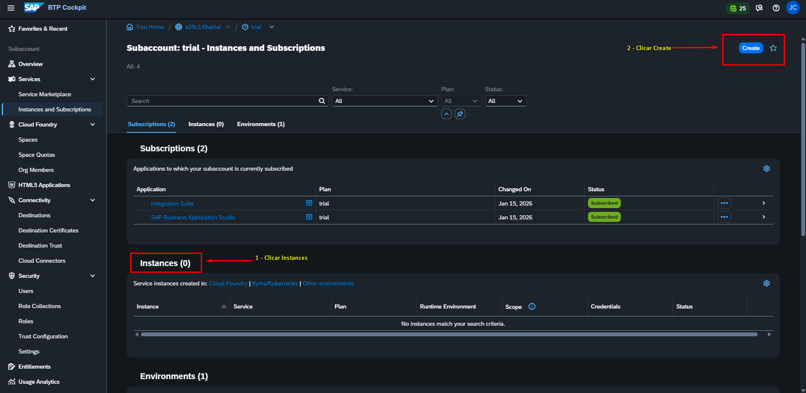

### Pesquisar pelo Integration Runtime
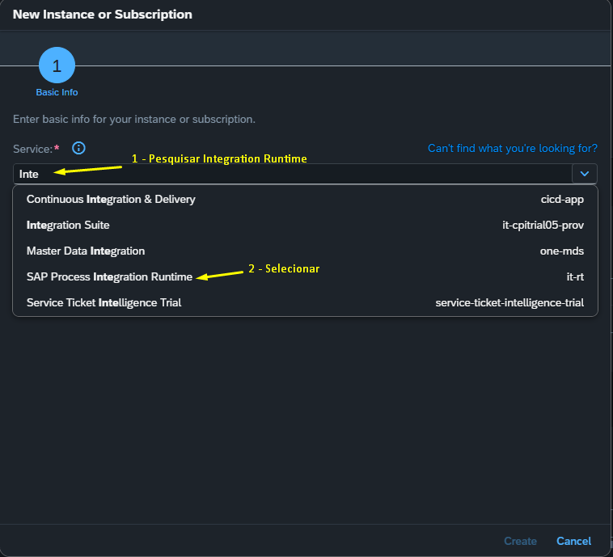

### Selecionar plano
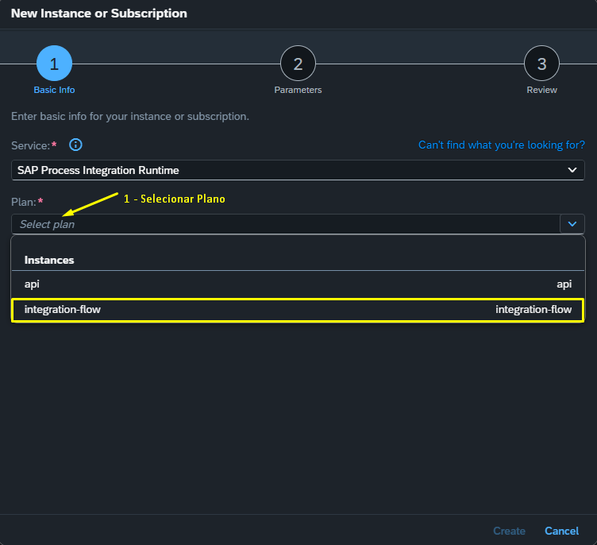

### Definir o nome
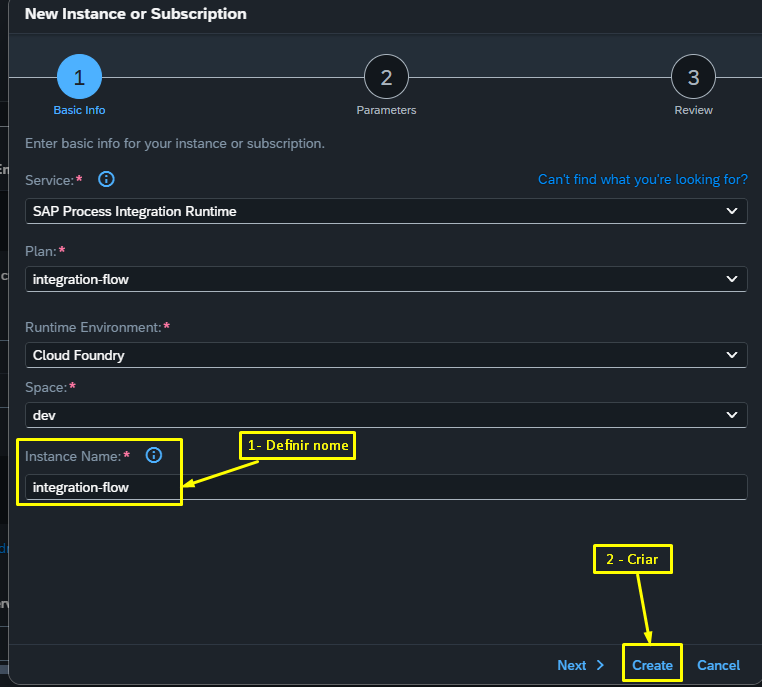

### Selecionar o Integration Runtime
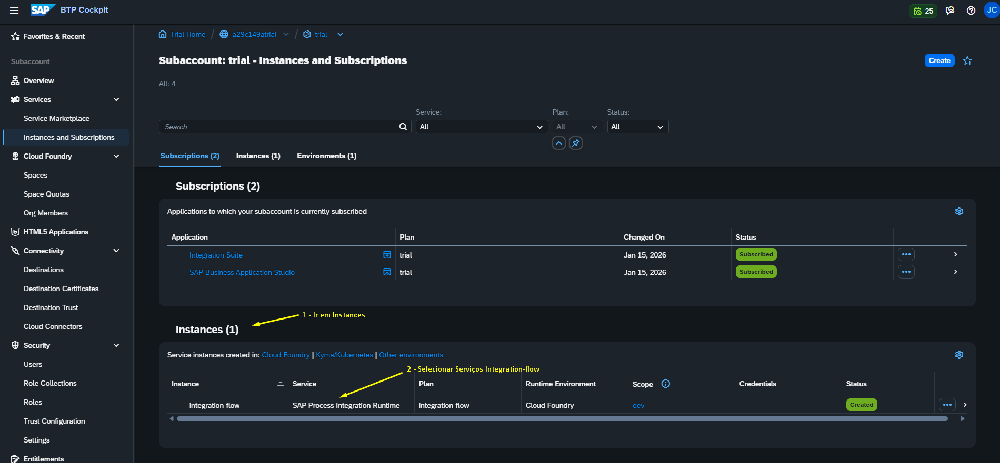

### Selecionar Service key


### Escrever o nome Service key
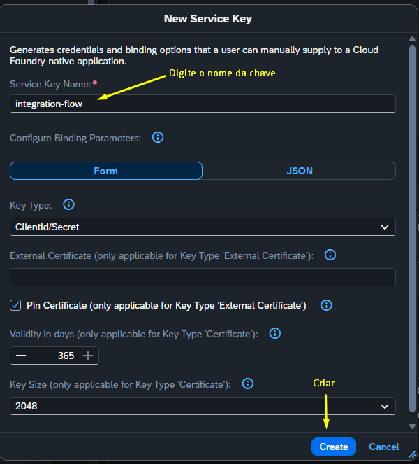

### Clicar para abrir o Service key
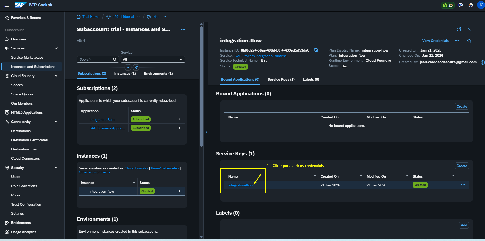

### Dados de configuração da Serve Key do Integration Runtime
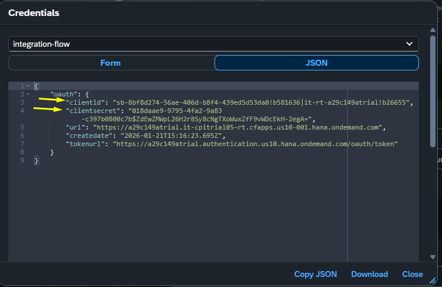

### Postmam procurar pela Variáveis
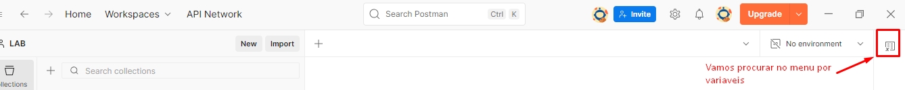

### Selecionar Todas as Variáveis
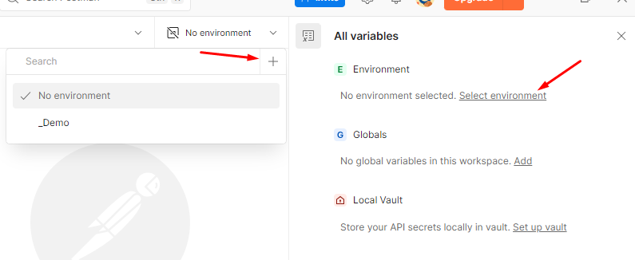

### Criando os segredos
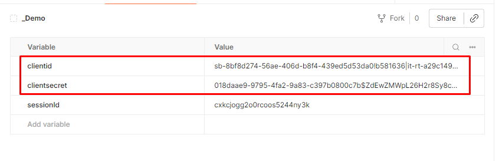

```
### 📦 Dessa forma conseguimos pegar o Endponit que o Iflow nos disponibiliza e usar no POSTMAN
